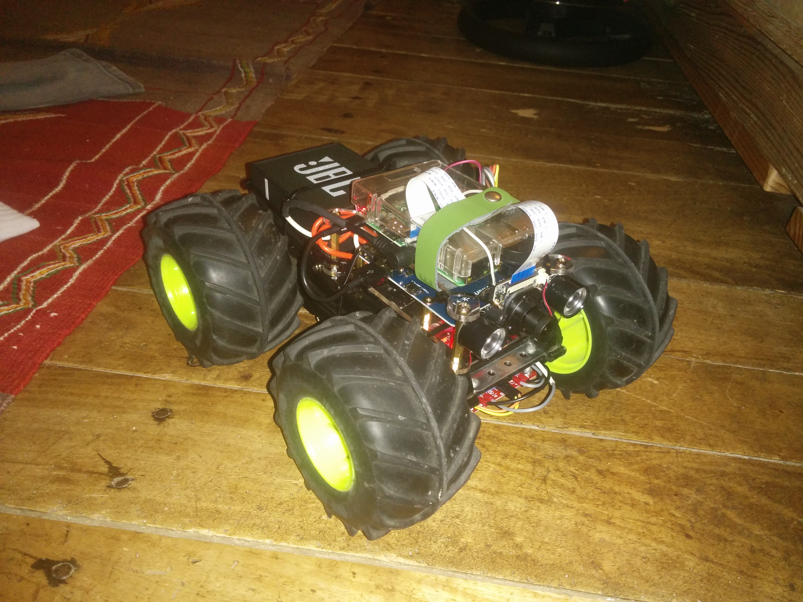

PiRobot
=======

Bienvenue sur le projet PiRObot !

Ce projet à pour objectif la fabrication d'un robot mobile, capable de voir, entendre, 
et pourquoi pas, d'interragir avec son environnement ...



Matériel utilisé :
------------------

* RaspberryPi3 avec sa carteSD, box, alim, clavier, souris, etc... :
-> https://www.amazon.fr/gp/product/B01CD5VC92/ref=oh_aui_detailpage_o06_s00?ie=UTF8&psc=1
-> https://www.amazon.fr/gp/product/B003WIRFDM/ref=oh_aui_detailpage_o05_s00?ie=UTF8&psc=1
-> https://www.amazon.fr/gp/product/B01DDFFOYK/ref=oh_aui_detailpage_o06_s01?ie=UTF8&psc=1

* Carte d'extention Batterie pour rendre le Rpi autonome en alim :
-> https://www.amazon.fr/gp/product/B06VVMHPFR/ref=oh_aui_detailpage_o01_s00?ie=UTF8&psc=1 

* Caméra IR-Cut :
-> https://www.amazon.fr/gp/product/B06XTKVPZN/ref=oh_aui_detailpage_o02_s00?ie=UTF8&psc=1

* DongleUSB Wifi (afin d'avoir une connexion Internet si la première interfacte wifi est en point d'acces) :
-> https://www.amazon.fr/gp/product/B008IFXQFU/ref=oh_aui_detailpage_o07_s00?ie=UTF8&psc=1

* Kit apprentissage bien utile, quelques capteurs intéressants (PIR, Ultrasonic distance sensor,...) :
-> https://www.amazon.fr/gp/product/B01N0TKCJN/ref=oh_aui_detailpage_o02_s01?ie=UTF8&psc=1

* L298N Double pont H DC Driver :
-> https://www.amazon.fr/gp/product/B071RN2NNK/ref=oh_aui_detailpage_o00_s00?ie=UTF8&psc=1

* 1 ou 2 Batterie(s) 6V 2300mAh NiMH + Chargeur à prévoir 6v ou 12v selon votre config moteurs (6v de base):
-> https://www.amazon.fr/gp/product/B00LAFZR0C/ref=oh_aui_detailpage_o04_s00?ie=UTF8&psc=1

* Micro (USB), enceinte portable (microJack) (nous installerons GoogleAssistant SDK plus tard) :
-> https://www.amazon.fr/gp/product/B01KLRBHGM/ref=oh_aui_detailpage_o06_s00?ie=UTF8&psc=1
-> https://www.amazon.fr/gp/product/B00TFGWAA8/ref=oh_aui_detailpage_o05_s00?ie=UTF8&psc=1

* Chassis TYCO Rebound (batterie HS, peut importe il faudra trouver une alternative):
-> http://www.ebay.com/bhp/tyco-rebound

* 2 Moteurs DC 12v 6000RPM 1.8A :
-> https://www.amazon.fr/gp/product/B008595SC8/ref=oh_aui_detailpage_o02_s00?ie=UTF8&psc=1


* un smartphone, un PC...


Utilitaires Windows sur le PC :
-------------------------------
 
-> SDFormater (formatage carte SD : options = erase et resize ON) 

-> Etcher (écriture image sur la carteSD)

-> Putty (SSH client)

-> Vim et Notepad++ (attention ce dernier n'aime pas le Pyhton..., d'ou Vim...)


Installation Logicielle :
-------------------------

Raspbian Jessie :

-> RASPBIAN JESSIE WITH PIXEL Image with PIXEL desktop based on Debian Jessie
   Version:April 2017; Release date:2017-04-10; Kernel version:4.4

-> Installation classique

-> Installer le serveur FTP :

```
sudo apt-get install vsftpd

sudo nano /etc/vsftpd.conf
```

changer :

```
Anonymous_enabled=YES
```

en

```
Anonymous_enabled=NO
```

Maintenant, enlevez le # devant les lignes suivantes :

```
Local_enable = YES
local_unmask=022
Write_enabled=YES
Ascii_upload_enabled=YES
Ascii_download_enabled=YES
```

Puis faites [ctrl] + [x] puis [o] puis [Entrée]


Installer le Dongle Wifi :
--------------------------

Le but de cette opération est de rendre le robot utilisable en conditions connectée et déconnectée.

L'interface wlan0 sera le point d'accès pour le smartphone qui va piloter le tout.
L'interface supplémentaire (dongle) wlan1 sera l'accès Internet.

Avant tout branchez le dongle, attribuez lui une IP fixe dans votre Box et routez le port TCP 8000 dessus.
Dans mon exemple 192.168.3.1

Définition d'une adresse IP statique
Dans le fichier /etc/network/interfaces, supprimer les lignes suivantes :

```
iface wlan0 inet manual
wpa-roam /etc/wpa_supplicant/wpa_supplicant.conf
Les remplacer par :

allow-hotplug wlan0
iface wlan0 inet static
address 192.168.3.1
netmask 255.255.255.0
```

Redémarrez le réseau :

```
sudo service networking restart
```

Installation d'un serveur DHCP

Le serveur DHCP permet d'attribuer automatiquement une adresse IP aux machines qui se connecteront à votre réseau Wifi.

Installez le paquet isc-dhcp-server :

```
sudo apt-get install isc-dhcp-server
```

À ce stade, le service ne devrait pas démarrer correctement :

Generating /etc/default/isc-dhcp-server...
[FAIL] Starting ISC DHCP server: dhcpd[....] check syslog for diagnostics. ... failed!
 failed!
invoke-rc.d: initscript isc-dhcp-server, action "start" failed.
Vous pouvez ignorer ces erreurs pour le moment.

Éditez le fichier de configuration du serveur : /etc/dhcp/dhcpd.conf et commentez les options domain-name et domain-name-servers :

```
#option domain-name "example.org";
#option domain-name-servers ns1.example.org, ns2.example.org;
```

Décommentez la ligne authoritative. 
Cela permet d'indiquer à votre serveur DHCP qu'il est le seul à fournir des adresses IP sur ce réseau et donc possède la pleine connaissance des baux accordés.

```
# If this DHCP server is the official DHCP server for the local
# network, the authoritative directive should be uncommented.
authoritative;
```

Enfin, configurez le comportement du serveur DHCP :

```
subnet 192.168.3.0 netmask 255.255.255.0 {
  range 192.168.3.10 192.168.3.50;
  option broadcast-address 192.168.3.255;
  option routers 192.168.3.1;
  default-lease-time 600;
  max-lease-time 7200;
  option domain-name "local";
  option domain-name-servers 80.67.169.12;
}
```

Le paramètre range limite la place d'adresses IP qui seront alouées. On en permet ici 51 : c'est probablement beaucoup (trop) s'il s'agit de votre réseau personnel.

L'option broadcast-address spécifie l'adresse IP telle que les paquets qui seront envoyés sur cette adresse seront interceptés par toutes les machines présentes sur ce réseau (ayant donc une IP entre 192.166.100.1 et 192.168.100.254 car le masque de sous réseau est 255.255.255.0).

Quant à elle, l'option routers indique l'adresse de la passerelle, c'est à dire la machine par laquelle passent tous les paquets sortants du réseau (en direction ou en provenance d'Internet par exemple).

On attribue ici un bail pour une durée de 600 secondes avec le paramètre default-lease-time. C'est cette durée qui sera utilisée si le client ne précise rien. S'il demande un bail en précisant une durée, celle-ci lui sera accordée si elle ne dépasse pas 7200 secondes, comme défini avec le paramètre max-lease-time.

Cet exemple utilise le DNS de FDN (ligne domain-name-servers). Vous pouvez bien évidemment en utiliser d'autres (certains préfèrent ceux de Google...).


Déclarez enfin l'interface sans fil comme l'interface par défaut pour répondre aux requêtes DHCP dans le fichier /etc/default/isc-dhcp-server :

```
# On what interfaces should the DHCP server (dhcpd) serve DHCP requests?
#       Separate multiple interfaces with spaces, e.g. "eth0 eth1".
#INTERFACES=""
INTERFACES="wlan0"
```

Installation de hostapd

Hostapd est un démon permettant de créer un point d'accès sans fil. Pour l'installer :

```
sudo apt-get install hostapd

```
Créez son fichier de configuration, /etc/hostapd/hostapd.conf :

```
interface=wlan0
driver=nl80211
ssid=<YOUR SSID>
hw_mode=g
channel=6
beacon_int=100
dtim_period=2
max_num_sta=40
rts_threshold=2347
fragm_threshold=2346
auth_algs=1
wpa=1
wpa_passphrase=<YOUR PASSPHRASE>
wpa_key_mgmt=WPA-PSK
wpa_pairwise=TKIP
```

Remplacez dans cet exemple :

<YOUR SSID> par le nom que vous souhaitez donner à votre réseau ;
<YOUR PASSPHRASE> par le mot de passer permettant l'accès au réseau.

Déclarez enfin ce fichier afin qu'il soit utilisé par hostapd dans /etc/default/hostapd en ajoutant la ligne :

```
DAEMON_CONF="/etc/hostapd/hostapd.conf"
```

Configuration du routage entre l'interface sans fil et l'interface filaire

Activer le routage IP dans le fichier /etc/sysctl.conf en décommentant la ligne suivante :

```
net.ipv4.ip_forward=1
```

Pour activer ce routage immédiatement (sans avoir besoin de redémarrer), lancez la commande :

```
sudo sh -c "echo 1 > /proc/sys/net/ipv4/ip_forward"
```

Vous pouvez enfin configurer le routage en utilisant iptables depuis la console :

```
sudo iptables -t nat -A POSTROUTING -o wlan1 -j MASQUERADE
sudo iptables -A FORWARD -i wlan1 -o wlan0 -m state --state RELATED,ESTABLISHED -j ACCEPT
sudo iptables -A FORWARD -i wlan0 -o wlan1 -j ACCEPT
```

Persistence des règles iptables

Les règles iptables définies précédemment sont perdues au au redémarrage. Pour les recharger à chaque lancement de la machine, vous pouvez utiliser le paquet iptables-persistent. Pour l'installer :

```
sudo apt-get install iptables-persistent
```

Par défaut, il demandera si vous souhaitez enregistrer les règles actuellement définies. Choisissez « oui ». Si vous souhaitez les redéfinir ultérieurement, vous pourrez les enregistrer en invoquant la cible save et les recharger avec reload :

```
sudo /etc/init.d/netfilter-persistent save

sudo /etc/init.d/netfilter-persistent reload
```

La voie est libre
À ce stade, vous deviez être en mesure de vous connecter au point d'accès de façon transparente. 
Étant donnée la richesse des matériels et leurs spécificités, je ne garantis pas que ce « mode d'emploi » soit universel. 
J'espère néanmoins qu'il vous aura aidé en première approche à monter votre propre point d'accès Wifi.


Installer la Caméra :
---------------------

Déballez et montez la caméra avec ses diodes IR, branchez la au Raspberry à l'aide de la nappe fournie.

Activez la caméra via votre écran ou par la console :
(si vous n'avez pas encore installé Puttyn il est grand temps !)

```
sudo raspi-config
```

et activez la caméra, rebootez.

Nous allons avoir besoin de streamer la vidéo vers une interface web, pour cela nous utiliserons Mjpg-streamer
(https://github.com/jacksonliam/mjpg-streamer)

```
sudo apt-get install cmake libjpeg8-dev
sudo git clone https://github.com/jacksonliam/mjpg-streamer
cd mjpg-streamer/mjpg-streamer-experimental
sudo make
sudo make install
```

Pour lancer la vidéo (a tester avant d'aller plus loin) :

```
cd mjpg-streamer/mjpg-streamer-experimental
export LD_LIBRARY_PATH=.
./mjpg_streamer -o "output_http.so -w ./www" -i "input_raspicam.so"
```

Vous pouvez accéder à la page qui hébèrge votre vidéo à l'adresse <IP du Raspberry>:8080

Ctrl+C pour stopper la vidéo.

Afin de pouvoir démarrer le service en une seule ligne de commande :

Pour déplacer le dossier d'installation :

```
sudo cp mjpg_streamer /usr/local/bin
sudo cp output_http.so input_file.so input_uvc.so input_raspicam.so /usr/local/lib/
sudo cp -R www /usr/local/www
```

Et Afin de pouvoir démarrer le service en une seule ligne de commande :

```
sudo nano /etc/init.d/livestream.sh
```

Copiez tout ce contenu :

```
#!/bin/sh
# /etc/init.d/livestream.sh
### BEGIN INIT INFO
# Provides:          livestream.sh
# Required-Start:    $network
# Required-Stop:     $network
# Default-Start:     2 3 4 5
# Default-Stop:      0 1 6
# Short-Description: mjpg_streamer for webcam
# Description:       Streams /dev/video0 to http://IP/?action=stream
### END INIT INFO
f_message(){
        echo "[+] $1"
}

# Carry out specific functions when asked to by the system
case "$1" in
        start)
                f_message "Starting mjpg_streamer"
                /usr/local/bin/mjpg_streamer -b -i "/usr/local/lib/mjpg-streamer/input_raspicam.so -x 640 -y 480 -rot 180 "  -o "/usr/local/lib/output_http.so -w /usr/local/www"
                sleep 2
                f_message "mjpg_streamer started"
                ;;
        stop)
                f_message "Stopping mjpg_streamer…"
                killall mjpg_streamer
                f_message "mjpg_streamer stopped"
                ;;
        restart)
                f_message "Restarting daemon: mjpg_streamer"
                killall mjpg_streamer
                /usr/local/bin/mjpg_streamer -b -i "/usr/local/lib/mjpg-streamer/input_raspicam.so -x 640 -y 480 -rot 180 " -o "/usr/local/lib/output_http.so -w /usr/local/www"
                sleep 2
                f_message "Restarted daemon: mjpg_streamer"
                ;;
        status)
                pid=`ps -A | grep mjpg_streamer | grep -v "grep" | grep -v mjpg_streamer. | awk ‘{print $1}’ | head -n 1`
                if [ -n "$pid" ];
                then
                        f_message "mjpg_streamer is running with pid ${pid}"
                        f_message "mjpg_streamer was started with the following command line"
                        cat /proc/${pid}/cmdline ; echo ""
                else
                        f_message "Could not find mjpg_streamer running"
                fi
                ;;
        *)
                f_message "Usage: $0 {start|stop|status|restart}"
                exit 1
                ;;
esac
exit 0
```

et enfin :

```
sudo chmod 755 /etc/init.d/livestream.sh

sudo update-rc.d livestream.sh defaults
```

La dernière commande ajoute mjpg-streamer au Boot.

Pour gérer le service :

```
sudo service livestream.sh start
sudo service livestream.sh stop
sudo service livestream.sh restart
```

Afin de stocker les photos que prendra le Robot, nous créons un dossier: /home/pi/Pictures/Photos


Installer WebIOPi :
-------------------

WebIOPi est un utilitaire qui va permettre à une page web hébergée sur le raspberry de communiquer avec un script Python.
Cela va nous permettre de créer notre interface et controler des ports GPIO.

Commencez par installer WiringPi :

```
git clone git://git.drogon.net/wiringPi
cd ~/wiringPi
git pull origin
./build
```

Puis WebIOPi :

https://github.com/thortex/rpi3-webiopi/wiki/HowToBuild


WebIOPi est à présent installé et fonctionnel, essayez de vous rendre sur <ip du raspberry>:8000
Vous devriez tomber sur une interface listant vos ports Gpio (par défaut : user = webiopi, pass = raspberry).


Google-Assistant SDK :
----------------------

Afin de profiter des immenses possibilités du SDK Google Assistant, et parceque c'est gratuit et libre :

https://developers.google.com/assistant/sdk/prototype/getting-started-pi-python/config-dev-project-and-account

Pour le démarrer au Boot, copiez le script GA.sh dans le répertoire /home/pi/ et rendez le éxécutable :

```
sudo chmod 755 GA.sh
```

et ajoutez cette ligne au bas du fichier /home/pi/.config/lxsession/LXDE-pi/autostart :

```
./GA.sh
```

Reboot et... : "Ok Google!"


Divers :
--------

Ajouter cette balise dans le Head de index.html afin de faire disparaitre la barre 
d'adresses quand vous aurez ajouté la page de commandes à votre menu principal (Android) :
 
```
<meta name="mobile-web-app-capable" content="yes">
```


Pilotage/Gestion :
------------------

Afin de controller les moteurs, nous allons utiliser un L298N Double pont H DC Driver.
Il faudra lui envoyer les infos de pilotage de moteurs sur 6 fils (2 moteurs, marche avant, marche arrière et vitesse).

Le signal envoyé sera de type PWM (Pulse With Modulation) pour la vitesse + GPIO pour activer les directions de sorte que chaque pin/cable controle une direction par moteur, 
avec modulation de la tention appliquée au moteur selon l'input des joystics (NippleJS).

Après avoir longtemps galéré avec Webiopi et le Python (faire passer une variable numérique du javascript au python semble 
compliqué...), j'ai finalement compris qu'il était possible de tout faire depuis le Javascript intégré dans la page Html
(même gerer les pins en PWM !!)


A ce stade, la vidéo (+IR), les photos(idem), la detection de distance, de mouvement et les relevés de T° du processeur 
fonctionnent via macro dans le script python et tout le pilotage manuel des moteurs se fait depuis la page web (Javascript)

Le Script Python permet au robot de :

- Se déplacer de façon autonome et à la demande (via l'interface, sans but précis pour l'instant) grace au capteur de distance

- Prendre des photos, activer/désactiver et afficher le stream camera (via l'interface)

- Prendre une photo en cas de mouvement détecté en mode surveillance (activable via interface)

- Converser via le SDK Google Assistant et le micro + enceinte...

Les moteurs ont étés changés pour plus de puissance/vitesse mais surtout plus de couple (le robot peinait sur les surfaces rugueuses, demis tours sur place impossibles...)
Du coup, le robot a eu tendance à re-devenir une Tyco Rebound et à se retourner, grimper aux murs, etc... La tention appliquée aux moteurs à été /2.
On retrouve une vitesse raisonnable, par contre, plus aucun obstacle ne lui résiste et il fait à présent ses demi-tours dans l'herbe sans problème !

Evolutions à venir :

- cette config met à genoux l'alim du raspberry (carte d'extention Quimat avc batterie 3.7v, 3700mAh)
=> power tank 5v 20000mAh commandé

- le robot va continuer sa route indéfiniement si il perd la connexion wifi alors que l'ordre est donné d'avancer... c'est problématique.
=> trouver un moyen de stopper les moteurs si plus de connexion à la page de contrôle... hum hum...


